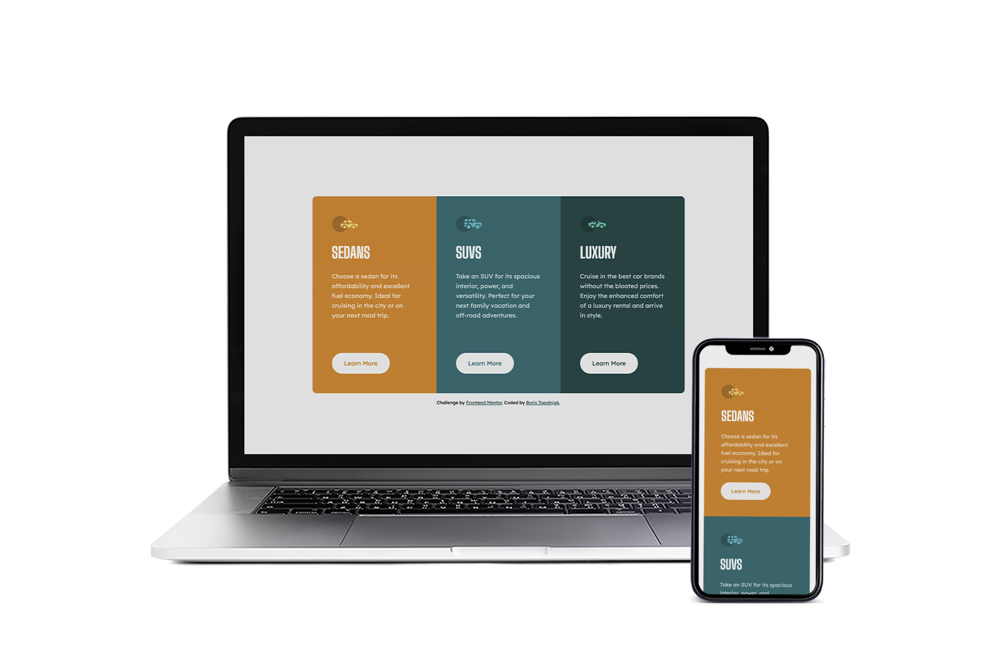

## Frontend Mentor - 3-column preview card component solution
This is a another solution to the [3-column preview card component challenge on Frontend Mentor](https://www.frontendmentor.io/challenges/3column-preview-card-component-pH92eAR2-). Frontend Mentor challenges help you improve your coding skills by building realistic projects.

### The challenge
Challenge is to build out this 3-column preview card component and get it looking as close to the design as possible. Users should be able to:
- [x] View the optimal layout depending on their device's screen size
- [x] See hover states for interactive elements

### Built Using
- [x] Semantic HTML5 markup
- [x] CSS custom properties
- [x] Mobile-first workflow

### Solution Preview

### Links
- Live Site URL: [Live Solution Preview](https://btopolnjak.github.io/fm-3-column-preview-card-component/)
- Website - [Boris Topolnjak](https://github.com/btopolnjak)
- Frontend Mentor - [@btopolnjak](https://www.frontendmentor.io/profile/btopolnjak)
- LinkedIn - [@boris-topolnjak](https://www.linkedin.com/in/boris-topolnjak-23334b104/)